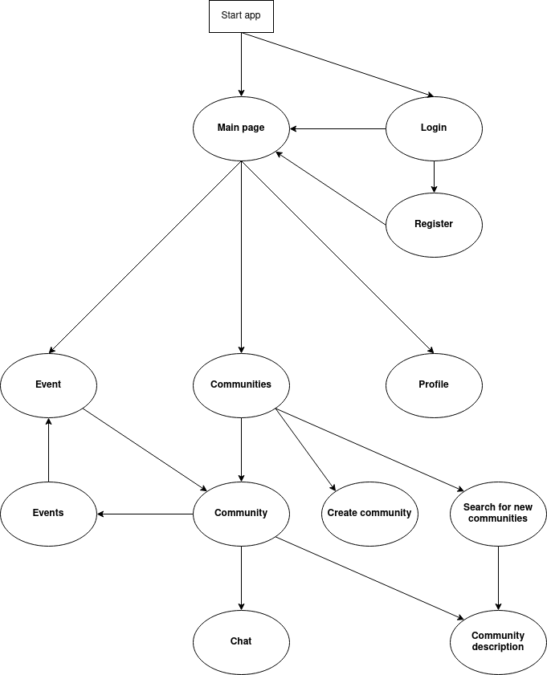

# University communities activity manager

The app helps de different communities inside a university to manage their activities so their members can be updated about the last events and know what is going on in an easy and intuitive way. 

## App functionality design

### Brief functionalities description

The user, using its university email, is able to log into the application and subscribe to the different communities. In the main page there is all the events posted by the communities the user is subscribed to. This one is also able to navigate to a community page and check all its respective information.

### Navigation flow

